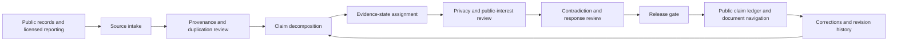

# Architecture

## System purpose

The reference architecture converts heterogeneous public records into a reviewable claim ledger while preventing source repetition, association records, or narrative momentum from being mistaken for proof.

## Logical components

### Source intake

Captures source title, issuing body, publication date, access date, stable identifier, document type, and rights or handling restrictions.

### Provenance layer

Determines whether multiple reports are independent, copied, circular, or derived from the same underlying record. Source volume is not treated as corroboration unless independence is established.

### Claim decomposition

Converts narrative statements into atomic propositions with a named subject, action or relationship, relevant time period, jurisdiction, and evidentiary burden.

### Evidence-state engine

Assigns one controlled state and records the basis for that state. State transitions require a dated reason and reviewer identity.

### Privacy and public-interest gate

Evaluates whether publication is necessary, proportionate, and supported. The gate excludes victim-identifying information, unnecessary private-person data, sealed material, and content whose harm exceeds its demonstrated public-interest value.

### Contradiction and response layer

Stores denials, alternative explanations, legal responses, conflicting records, and material uncertainty alongside the claim rather than in a detached disclaimer.

### Release gate

A record is publishable only when required fields are complete, evidence labels match the cited record, privacy review is satisfied, and the public wording does not exceed what the evidence supports.

### Revision ledger

Preserves the previous state, new state, reason, date, and reviewer. Corrections are not silently overwritten.

## Public-safe data boundary

This repository contains only fictional examples. A production implementation should separate public metadata from restricted source files, reviewed claims from raw extraction output, victim or private-person records from public profiles, credentials from repository content, and internal moderation notes from publishable reasoning.

## Release gates

1. Source identity and date recorded.
2. Claim reduced to an atomic proposition.
3. Evidence state justified.
4. Independent corroboration assessed.
5. Contradictions and responses represented.
6. Privacy and public-interest review passed.
7. Wording checked against the evidence ceiling.
8. Revision conditions stated.
9. Public-safe export generated.
10. Automated validation passed.
